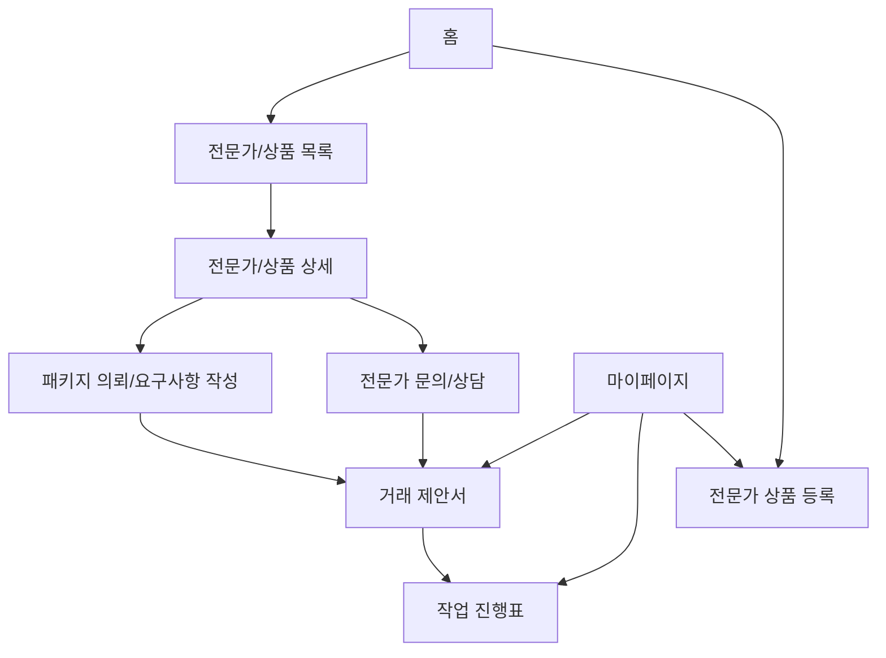
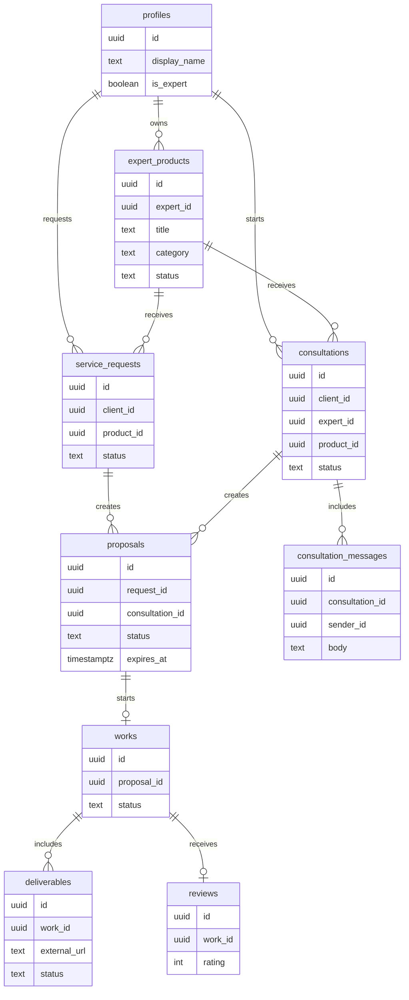

# 기그온 기술 설계 문서

> 작성일: 2026-05-14
> 목적: 초기 런칭 범위에 맞춰 프론트엔드, 데이터, 페이지, 구현 순서를 정리한다.

---

## 1. 기술 스택

현재 저장소의 기존 구조를 유지한다.

```text
Frontend: React + TypeScript + Vite
Routing: react-router-dom
Backend/Data: Supabase
Auth: Supabase Auth
Storage: Supabase Storage + 외부 링크 병행
Style: 기존 CSS 파일 기반
```

초기 런칭에서는 별도 백엔드 서버를 만들지 않는다. 프론트엔드가 Supabase와 직접 통신하고, 중요한 접근 제어는 Supabase RLS 정책으로 보호한다.

---

## 2. 설계 원칙

1. 기존 코드를 버리지 않고 재사용한다.
2. 전문가 중심 화면을 상품 중심 화면으로 바꾼다.
3. 결제 기능보다 거래 흐름과 작업 진행표를 먼저 만든다.
4. 대용량 작업물은 서버에 직접 저장하지 않고 링크 중심으로 처리한다.
5. 외부 연락처 입력은 받지 않는다.

---

## 3. 전체 페이지 구조



초기 사이트는 8개 화면을 중심으로 구성한다.

| 페이지 | 역할 | 기존 재사용 |
|---|---|---|
| 홈 | 포지셔닝, 카테고리, 추천 상품 진입 | `Home.tsx` |
| 전문가/상품 목록 | 상품 카드 탐색 | `Category.tsx`, `ExpertCard.tsx` |
| 전문가/상품 상세 | 샘플, 패키지, AI 도구 확인 | `ExpertDetail.tsx`, `PackageCard.tsx` |
| 요구사항 작성 | 의뢰 요청 접수 | `ServiceRequest.tsx` |
| 전문가 문의/상담 | 결제 전 작업 범위와 조건 협의 | 신규 상담/메시지 화면 |
| 거래 제안서 | 전문가가 최종 조건 제안 | 신규 페이지 |
| 작업 진행표 | 단계별 상태와 산출물 확인 | 신규 페이지 |
| 상품 등록 | 전문가가 AI 상품 등록 | `Profile.tsx` 일부 재구성 |
| 마이페이지 | 요청, 제안서, 작업, 상품 관리 | `MyPage.tsx` |

---

## 4. 권장 폴더 구조

현재 폴더 구조를 유지하되, 기능이 커지는 화면은 점진적으로 분리한다.

```text
src/
  components/
    ProductCard.tsx
    PackageCard.tsx
    WorkProgress.tsx
    ProposalSummary.tsx
  constants/
    routes.ts
    categories.ts
    policies.ts
  contexts/
    AuthContext.tsx
  data/
    mockData.ts
  lib/
    supabase.ts
    storage.ts
  pages/
    Home.tsx
    Category.tsx
    ExpertDetail.tsx
    ServiceRequest.tsx
    Proposal.tsx
    Workroom.tsx
    ProductForm.tsx
    MyPage.tsx
  types/
    index.ts
```

초기에는 기존 파일을 많이 옮기지 않는다. 새 기능에 필요한 컴포넌트만 추가하고, 큰 파일은 작업하면서 필요한 만큼만 나눈다.

---

## 5. 라우팅 설계

초기 라우트는 다음처럼 잡는다.

```text
/                       홈
/category/:categoryId   전문가/상품 목록
/experts/:expertId      전문가/상품 상세
/request/:productId     패키지 의뢰/요구사항 작성
/consultations/:id      결제 전 전문가 문의/상담
/proposals/:proposalId  거래 제안서
/workrooms/:workId      작업 진행표
/products/new           전문가 상품 등록
/mypage                 마이페이지
/login                  로그인
/onboarding             온보딩
```

`/experts/:expertId`는 당장은 기존 경로를 유지하되, 화면 내용은 전문가 상세보다 상품 상세에 가깝게 바꾼다. 나중에 데이터 구조가 안정되면 `/products/:productId`로 변경할 수 있다.

---

## 6. 데이터 모델

초기 핵심 테이블은 다음 순서로 설계한다.



상태 값은 `DataModelPlan.md`의 상태 정의를 따른다.

---

## 7. 주요 데이터 흐름

의뢰자 흐름:

```text
홈
→ 카테고리 선택
→ 상품 목록 탐색
→ 상품 상세 확인
→ 패키지 선택
→ 요구사항 작성
→ 거래 제안서 확인
→ 승인
→ 작업 진행표 확인
→ 완료 후 리뷰
```

전문가 흐름:

```text
전문가 시작
→ 상품 등록
→ 의뢰 요청 수신
→ 거래 제안서 작성
→ 작업 진행표에서 상태 변경
→ 산출물 링크 제출
→ 완료
```

---

## 8. 인증과 권한

초기 권한 규칙:

- 로그인 사용자는 의뢰 요청을 만들 수 있다.
- 상품 소유자만 자신의 상품을 수정할 수 있다.
- 의뢰 요청을 받은 전문가만 해당 요청에 제안서를 보낼 수 있다.
- 제안서의 의뢰자만 승인, 수정 요청, 취소를 할 수 있다.
- 작업의 의뢰자와 전문가만 작업 진행표를 볼 수 있다.
- 완료된 작업의 의뢰자만 리뷰를 작성할 수 있다.

Supabase RLS는 위 규칙을 기준으로 작성한다. 개발 초기에는 mock data로 화면을 먼저 맞추고, 이후 Supabase 연결 단계에서 RLS를 확정한다.

---

## 9. 산출물 저장 설계

초기 저장 전략:

- 플랫폼 DB에는 산출물 메타데이터를 저장한다.
- 소형 파일은 Supabase Storage에 제한적으로 저장한다.
- 대용량 파일은 외부 링크를 저장한다.

산출물 데이터:

```text
작업 ID
단계 ID
설명
외부 링크
소형 파일 URL
제출 시각
승인/수정 상태
```

이 방식은 서버 비용을 줄이고, 초기 런칭에서 영상/소스코드 같은 큰 파일을 안정적으로 다루기 쉽다.

---

## 10. 구현 순서

초기 구현은 다음 순서가 좋다.

1. 타입과 mock data 정리
2. 홈 페이지 메시지와 카테고리 개편
3. 상품 목록 카드 개편
4. 상품 상세와 패키지 CTA 개편
5. 요구사항 작성 폼 개편
6. 거래 제안서 화면 추가
7. 작업 진행표 화면 추가
8. 전문가 상품 등록 화면 개편
9. 마이페이지에서 요청/제안/작업 연결
10. Supabase 테이블과 RLS 연결

처음에는 mock data로 전체 사용자 흐름을 빠르게 검증하고, 흐름이 확정된 뒤 Supabase 저장을 붙인다.

---

## 11. 테스트 전략

구현 단계에서는 TDD 순서를 따른다.

우선 테스트할 항목:

- 상품 카드가 가격, AI 도구, 샘플 정보를 보여주는지
- 요구사항 작성에서 연락처 입력이 없는지
- 제안서가 3일 만료 상태를 계산하는지
- 제안서 승인 전 작업 진행표가 생성되지 않는지
- 산출물이 링크 중심으로 저장되는지
- 완료된 작업에만 리뷰 작성 버튼이 보이는지

프론트엔드 테스트 도구는 이후 구현 계획에서 확정한다. 현재 저장소에는 테스트 설정이 없으므로, 구현 전 테스트 도구 도입 여부를 먼저 결정해야 한다.

---

## 12. 런칭 제외 범위

초기 런칭에서 제외한다.

- 자동 결제
- PG 연동
- 에스크로
- 단계별 자동 정산
- 작업방 실시간 채팅 고도화
- 전자계약서
- 추천 알고리즘
- 전문가 등급
- 광고/상위 노출
- 고급 관리자 페이지

---

## 13. 결론

기그온 초기 아키텍처는 기존 React/Supabase 구조를 유지하면서, 화면과 데이터 흐름을 AI 상품 거래 중심으로 재정렬한다.

가장 중요한 구현 목표는 다음이다.

```text
상품을 보고
요구사항을 보내고
제안서를 승인하고
작업 진행표에서 산출물을 확인하는 흐름
```

이 흐름이 안정되면 결제, 정산, 분쟁 조정, 추천 기능을 단계적으로 붙인다.
---

## 2026-06-10 수정: 결제/정산 아키텍처 포함

첫 런칭부터 결제와 정산 기능을 포함한다.

추가 페이지:

```text
/checkout/:proposalId       결제 페이지
/mypage/payments            요청자 결제 내역
/mypage/settlements         메이커 정산 내역
```

추가 데이터:

```text
payments
settlements
platform_fees
refund_requests
```

수정된 핵심 흐름:

```text
proposal accepted
→ payment pending
→ payment paid
→ work created
→ deliverable approved
→ settlement available
→ settlement paid
```

권한 원칙:

- 요청자만 자신의 결제를 생성하고 볼 수 있다.
- 메이커는 자신에게 연결된 정산 내역만 볼 수 있다.
- 운영자는 환불, 정산 보류, 정산 완료 상태를 관리할 수 있어야 한다.
- 결제 완료 전에는 작업 진행표가 활성화되지 않는다.
---

## 최신 구현 메모: 작업방 예외상황 필드

작업방 정책을 위해 `works` 데이터에는 다음 필드를 사용한다.

- `revisionLimit`: 제안서에 명시된 수정 가능 횟수
- `revisionUsed`: 작업방에서 이미 사용한 수정 요청 횟수
- `refundStatus`: 취소 후 환불 처리 전 상태. 첫 런칭 기준 값은 `fee_excluded_refund_pending`
- `cancellationReason`: `before_start` 또는 `mutual_after_start`
- `cancelledAt`: 취소 처리 시각

작업방에서는 결과물 내용 변경이나 범위 확장 CTA를 제공하지 않는다. 수정 요청은 `revisionUsed < revisionLimit`일 때만 가능하다.
